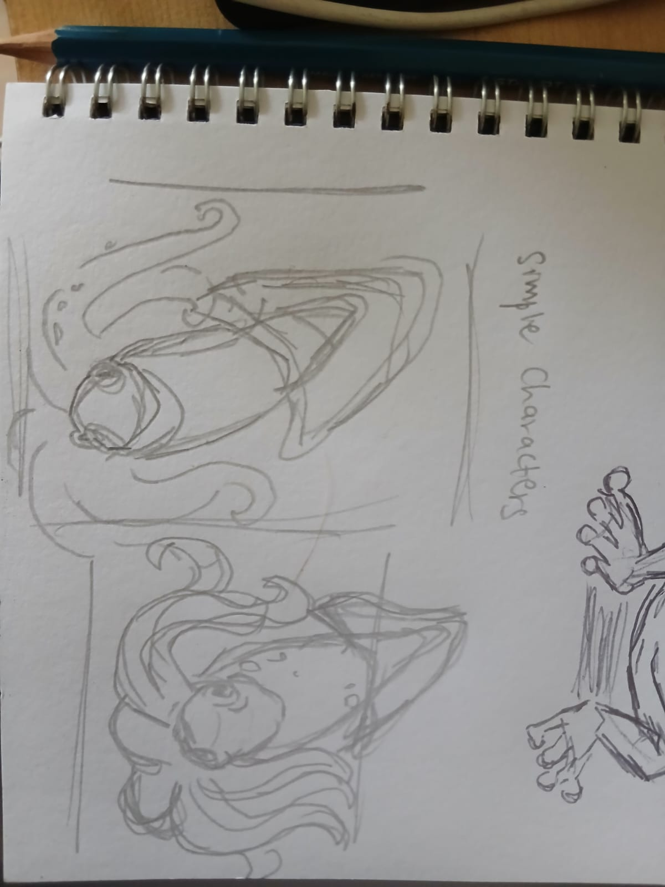
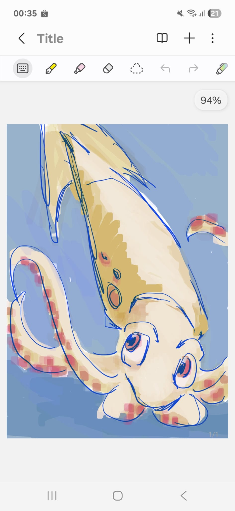

# Asset Validation Tool (Blender Python)

A Python-based toolset built in Blender to automate common asset checks and small rig utilities.  
This project uses a stylized squid model as a test asset to explore Technical Artist / Pipeline TD workflows.

The repository includes:
- original concept sketches
- a clean 3D asset
- a deliberately broken version of the model
- Python scripts used to validate and test assets

---

## ✨ Features

### Model Checker
Automated validation checks for common asset problems:

- Transform validation (unapplied scale / rotation)  
- Naming convention checks
- Flipped normals detection  
- Polycount reporting  
- UV existence check (detects missing UV maps)

**Demos**

**Transform** 

**Naming** 

**Normals** 

**Polygon** 

**UV** 

---

### Rig & Utility Tools

Small quality-of-life tools focused on rig consistency and testing:

**Automatic Bone Naming**  

**Procedural Wiggle Bones (Tail Test)**  

---

## 🦑 Asset Overview

The squid model was intentionally kept simple to reflect stylized production assets.  
After creating a clean version, the asset was deliberately “broken” to test the validation tools.

---

## 🎯 Project Goal

This project was created to explore the **Technical Artist / Pipeline TD role**, with a focus on:
- asset validation
- workflow automation
- bridging art and code
- detecting common production-breaking issues early

The emphasis is on **detection and feedback**, rather than automatic fixing.

---

## 📝 Concept Sketch

